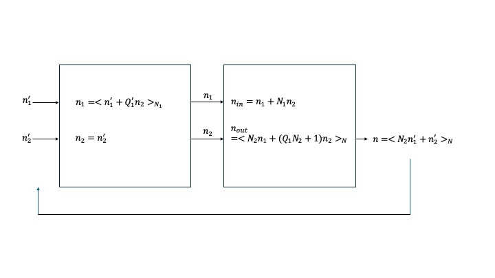

# Prime Factor Algorithm $N_1,N_2$ Decomposition

N is decomposed into coprime $N_1$ and $N_2$ with
the Prime Factor Algorithm.

The parameters needed are calculated using the extended Euclid algorithm, where $L=N_1$ and $M=N_2$:

```julia
function extended_euclid(a, b)
    @assert a>=0 && b>=0 "a and b must be non-negative"
    if a == 0
        return (b, 0, 1)
    else
        (g, y, x) = extended_euclid(mod(b, a), a)
    end
    (g, x - (b ÷ a) * y, y)
end
(g, M1, M2) = extended_euclid(L, M)
Q1 = -M2
Q2 = -M1
Q1P = mod(L + M2, L)
Q2P = mod(M + M1, M)
```

## n mapping

$$
n = (N_2 n_1 + A_2 n_2) \space \text{mod} \space N
$$

$$
A_2 = p_1 N_1 = q_1 N_2 + 1
$$

$$
n_{forward} = (N_2 n_1 + N_1 \times \left< N_1^{-1} \right> \times n_2) \space \text{mod} \space N
$$

$$
n = N_2 n_1' + n_2' = \left< N_2 n_1 + (Q_1 N_2 + 1) n_2 \right>_N
$$



## n mapping implementation

$$
n_1 = \left< n_1' + \left< Q_1' n_2' \right>_{N_1} \right>_{N_1}
$$

$$
n_2 = n_2'
$$

```julia
mask_mux_mod(a, B) = a - (B & -(a ≥ B))

rhs_n = 1
for n1p = 0:L-1
    R1 = 0
    for n2p = 0:M-1
        n1 = mask_mux_mod(n1p + R1, L)
        lhs_n = n1 + L * n2p + 1
         @inbounds Y[lhs_n] = X[rhs_n]
         R1 = mask_mux_mod(R1 + Q1P, L)
         rhs_n += 1
      end
 end
```

## k mapping

$$
k = (B_1 k_1 + N_1 k_2) \space \text{mod} \space N
$$

$$
B_1 = p_2 N_2 = q_2 N_1 + 1
$$

$$
k_{forward} = ( N_2 \times \left< N_2^{-1}\right> \times k_1 + N_1 k_2) \space \text{mod} \space N
$$

### Candidate Solution for k

$$
k_1 = k_1'
$$

$$
k_2 = (k_2' + Q_2' \times k_1') \space \text{mod} \space N_2
$$

Prove that with these $k_1,k_2$ that:

$$
\langle k_1' + N_1 k_2' \rangle_N = \langle (Q_2 N_1 + 1) k_1 + N_1 k_2 \rangle_{N}
$$

See lean/pfak2.lean in MinimalFFT.jl repository for proof.

## k mapping implementation

$$
k_1 = k_1' \\[0.2cm]
k_2 = \left< k_2' + \left< Q_2' k_1'  \right>_{N_2} \right>_{N_2}
$$

```julia
mask_mux_mod(a, B) = a - (B & -(a ≥ B))

lhs_k = 1
for k2p = 0:M-1
    R1 = 0
    for k1p = 0:L-1
        k2 = mask_mux_mod(k2p + R1, M)
        rhs_k = k1p + k2 * L + 1
        @inbounds Y[lhs_k] = X[rhs_k]
         R1 = mask_mux_mod(R1 + Q2P, M)
        lhs_k += 1
    end
end
```

## References


[1] A. Wang, J. Bachrach and B. Nikolié, "A generator of memory-based, runtime-reconfigurable 2N3M5K FFT engines," 2016 IEEE International Conference on Acoustics, Speech and Signal Processing (ICASSP), Shanghai, China, 2016, pp. 1016-1020, doi: 10.1109/ICASSP.2016.7471829

[2] Wang, Angie.  Ph.D. Dissertation, UC Berkeley.  "Agile Design of Generator-Based Signal Processing Hardware," 2018.

[3] C. -F. Hsiao, Y. Chen and C. -Y. Lee, "A Generalized Mixed-Radix Algorithm for Memory-Based FFT Processors," in IEEE Transactions on Circuits and Systems II: Express Briefs, vol. 57, no. 1, pp. 26-30, Jan. 2010, doi: 10.1109/TCSII.2009.2037262
