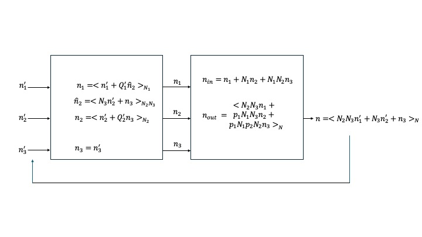

## Prime Factor Algorithm: Three Decomposition

Assume N is decomposed in order $N_1,N_2,N_3$ which are coprime (GCD=1).

## n Index Generation

$$
n = (N_2N_3n_1 + A_1\tilde{n_2}) mod N \\

\tilde{n_2} = (N_3 n_2 + A_2 n_3) mod N_2 N_3
$$

$$
A_1 = p_1 N_1 = Q_1 N_2 N_3 + 1, Q_1 = q_1 \\
A_2 = p_2 N_2 = Q_2 N_3 + 1, Q_2 = q_2 N_1 \\
$$

$Q_x$ is calculated via the Julia extended Euclidean algorithm $\text{gcd(a,b)}=ax+by$.

```julia
function extended_euclid(a, b)
    @assert a>=0 && b>=0 "a and b must be non-negative"
    if a == 0
        return (b, 0, 1)
    else
        (g, y, x) = extended_euclid(mod(b, a), a)
    end
    (g, x - (b ÷ a) * y, y)
end
```

Substitution of (2) into (1) yields

$$
n = (N_2 N_3 n_1 + p_1 N_1 N_3 n_2 + p_1 N_1 p_2 N_2 n_3) \space \text{mod} \space N
$$

The reversed order $N_3,N_2,N_1$ is omitted here.  This input equation can be rewritten [3] as

$$
n = (N_2N_3 n_1' + \tilde{n_2}) \space \text{mod N} \\
\tilde{n_2} = (N_3 n_2' + n_3) \space \text{mod} \space N_2 N_3
$$

$$
n_1 = \left< n_1' + Q_1' \tilde{n_2} \right>_{N_1} \\
n_2 = \left< n_2' + Q_2' n_3 \right>_{N_2}
$$

$$
n = \left< N_2 N_3 n_1' + N_3 n_2' + n_3 \right> \space \text{mod} \space N [3]
$$

$$
Q_x' = (N_x - Q_x) \space \text{mod} \space N_x
$$

The $\tilde{n_2}$ counter increments when wrap condition (W.C.) is met: $n_2'=N_2-1$ and $n_3'=N_3-1$.



$$
n_{forward} = ((N_2 N_3) n_1 + N_1 \times \left< N_1^{-1} \right>_{N_2N_3} \times \tilde{n}_{2,forward}) \space \text{mod} \space N \\
\tilde{n}_{2,forward} = ((N_3 n_2 + N_2 \times \left< N_2^{-1} \right>)_{N_3} \times n_3) \space \text{mod} \space N_2N_3
$$

$$
Q_1 (N_2 N_3) + 1 = \left< N_1^{-1}\right>_{N_2 N_3} \times N_1 \\
Q_2 N_3 + 1 = \left< N_2^{-1} \right>_{N_3} \times N_2
\\[0.5cm]

n_{forward} = ((N_2 N_3) n_1 + (Q_1 N_2 N_3 + 1) \times (N_3 n_2 + (Q_2 N_3 + 1 )\times n_3))) 
$$

### n-Indexer Implementation

$$
R_1 := \begin{cases}
0 & \text{if W.C.} \\
(R_1 + Q_1') \space \text{mod} \space N_1 & \text{otherwise} 
\end{cases}
\\[0.5cm]
R_2 := \begin{cases}
0 & \text{if} \space n_3' = N_3 - 1 \\
(R_2 + Q_2') \space \text{mod} \space N_2 & \text{otherwise}
\end{cases}
\\[0.5cm]
n_1 = (n_1' + R_1) \space \text{mod} \space N_1 \\
n_2 = (n_2' + R_2) \space \text{mod} \space N_2
$$

```julia
function nmap(Y, X, N1, N2, N3, Q1P, Q2P, Q3P, Q4P)
    mask_mux_mod(a, B) = a - (B & -(a ≥ B))

    rhs_n = 1
    for n1p = 0:N1-1
        R1 = 0
        for n2p = 0:N2-1
            R2 = 0
            for n3p = 0:N3-1
                n1 = mask_mux_mod(n1p + R1, N1)
                n2 = mask_mux_mod(n2p + R2, N2)
                lhs_n = n1 + N1 * n2 + N1 * N2 * n3p + 1
                Y[lhs_n] = X[rhs_n]
                R1 = mask_mux_mod(R1 + Q1P, N1)
                R2 = mask_mux_mod(R2 + Q2P, N2)
                rhs_n += 1
            end
        end
    end
end
```

## k Index Generation

$$
k=(B_1k_1+N_1\tilde{k_2}) \space \text{mod} \space N \\
\tilde{k_2}=(B_2k_2+N_2k_3) \space \text{mod} \space N_2N_3
$$

$$
B_2 = p_3 N_3 = Q_3 N_2 + 1, Q_3 = q_3 N_1 \\
B_1 = p_4(N_2 N_3) = Q_4 N_1 + 1 = \left< (N_2N_3)^{-1} \right>_{N_1} \times N_2 N_3 \space \text{[2]}
$$

$$
k=(p_2 p_3 N_2 N_3 k_1 + N_1\tilde{k_2}) \space \text{mod} \space N \\
\tilde{k_2}=(p3 N_3 k_2 + N_2 k_3) \space \text{mod} \space N_2N_3
\\[0.5cm]
k=(p_2 p_3 N_2 N_3 k_1 + p_3 N_1 N_3 k_2 + N_1 N_2 k_3) \space \text{mod} \space N
$$

$$
k_{forward} = ((N_2N_3) \times \left< (N_2 N_3)^{-1} \right>_{N_1} \times k_1 + N_1 \tilde{k}_{2, forward}) \space \text{mod} \space N \tag{thesis 2.68}
$$

$$
\tilde{k}_{2,forward} = (N_3 \times \left< N_3^{-1} \right>_{N_2} \times k_2 + N_2 k_3 ) \space \text{mod} \space N_2N_3 \tag{thesis 2.69}
$$

Substitute the following:

$$
Q_3 N_2 + 1 = \left< N_3^{-1} \right>_{N_2} \times N_3 \tag{thesis 2.64}
$$

$$
Q_4 N_1 + 1 = \left< (N_2 N_3)^{-1} \right>_{N_1} \times N_2 N_3 \tag{thesis 2.65}
$$

To yield:

$$
k_{forward} = ((Q_4 N_1 + 1) \times k_1 + N_1 \tilde{k}_{2,forward}) \space \text{mod} \space N
$$

$$
\tilde{k}_{2,forward} = \left< (Q_3 N_2 + 1) \times k_2 + N_2 k_3 \right>_{N_2N_3}
$$

### Solve for $k_1',k_2',k_3'$:

$$
k=N_2 N_3 k_1' + N_3 k_2' + k_3' =  ((Q_4N_1+1) \times k_1 + N_1 \times \left< (Q_3N_2+1) \times k_2 + N_2 \times k_3 \right>_{N_2 N_3}) \space \text{mod} \space N
$$

Candidate solution (what was implemented):
$$
k_1 = k_1'
$$

$$
P_1 = \left< N_2 - Q_4 \right>_{N_2} = mod(-Q_4, N_2)
$$

$$
P_2 = \left< N_3 - (Q_3 \div N_1) \right>_{N_3} = mod(-Q_3 \div N_1,N_3)
$$

$$
k_2 = \left< k_2' + \left< P_1 \times k_1' \right>_{N_2} \right>_{N_2}
$$

$$
k_3 = \left< k_3' + \left< P_2 \times ( k_1' + N_1 * k_2') \right>_{N_3} \right>_{N_3}
$$

#### Modulo Identities for Proof

$$
(ab) \space \text{mod} \space N = (a \space \text{mod} \space N \times b \space \text{mod} \space N) \space \text{mod} \space N \tag{I1}
$$

$$
(a \space \text{mod} \space N) \space \text{mod} \space N = a \space \text{mod} \space N \tag{I2}
$$

$$
(a + b) \space \text{mod} \space N = [(a \space \text{mod} \space N) + (b \space \text{mod} \space N)] \space \text{mod} \space N \tag{I3}
$$

$$
(a \space \text{mod} \space N + b) \space \text{mod} \space N = (a + b) \space \text{mod} \space N \tag{I4}
$$

$$
(Ab) \space \text{mod} \space (AN) = A(b \space \text{mod} \space N) \tag{I5}
$$

### Proof of Candidate Solution for k Index

$$
k=((Q_4N_1+1) \times k_1 + N_1 \times \left< (Q_3N_2+1) \times k_2 + N_2 \times k_3 \right>_{N_2 N_3}) \space \text{mod} \space N
$$

### k index implementation

$$
R_1 := \begin{cases}
0 & \text{if W.C.} \\
(R_1 + P_1) \space \text{mod} \space N_2 & \text{otherwise}
\end{cases} \\[0.5cm]
R_2 := \begin{cases}
0 & if n_3' = N_3 -1 \\
(R_2 + P_2) \space \text{mod} \space N_3
\end{cases}
\\[0.5cm]
n_2 = (n_2' + R_1) \space \text{mod} \space N_2 \\
n_3 = (n_3' + R_2) \space \text{mod} \space N_3
$$

```julia

function Qs(N1, N2, N3)
    (g1, p1, q1) = extended_euclid(N1, N2 * N3)
    (g2, p2, q2) = extended_euclid(N2, N1*N3)
    (g3, p3, q3) = extended_euclid(N3, N1*N2)
    (g4, p4, q4) = extended_euclid(N2*N3, N1)

    @assert g1 == 1 && g2 == 1 && g3 == 1 && g4 == 1 "N1, N2, N3 must be coprime"
    (p1, p2, p3, p4, -q1, -q2*N1, -q3*N1, -q4)
end

# TBD: Prove that P1 and P2 below are correct.
P1 = mod(-Q4, N2)
P2 = mod(-Q3 ÷ N1, N3)

function kmap!(Y, X, N1, N2, N3, P1, P2)
    mask_mux_mod(a, B) = a - (B & -(a ≥ B))

    lhs_k = 1
    for k3p = 0:N3-1
        R2 = 0
        for k2p = 0:N2-1
            R1 = 0
            for k1p = 0:N1-1
                k2 = mask_mux_mod(k2p + R1, N2)
                k3 = mask_mux_mod(k3p + R2, N3)
                rhs_k = k1p + N1 * k2 + N1 * N2 * k3 + 1
                Y[lhs_k] = X[rhs_k]
                R1 = mask_mux_mod(R1 + P1, N2)
                R2 = mask_mux_mod(R2 + P2, N3)
                lhs_k += 1
            end
        end
    end
end
```

### References

[1] A. Wang, J. Bachrach and B. Nikolié, "A generator of memory-based, runtime-reconfigurable 2N3M5K FFT engines," 2016 IEEE International Conference on Acoustics, Speech and Signal Processing (ICASSP), Shanghai, China, 2016, pp. 1016-1020, doi: 10.1109/ICASSP.2016.7471829

[2] Wang, Angie.  Ph.D. Dissertation, UC Berkeley.  "Agile Design of Generator-Based Signal Processing Hardware," 2018.

[3] C. -F. Hsiao, Y. Chen and C. -Y. Lee, "A Generalized Mixed-Radix Algorithm for Memory-Based FFT Processors," in IEEE Transactions on Circuits and Systems II: Express Briefs, vol. 57, no. 1, pp. 26-30, Jan. 2010, doi: 10.1109/TCSII.2009.2037262
